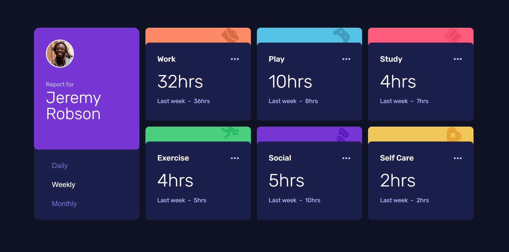

# Frontend Mentor - Time tracking dashboard solution

This is a solution to the [Time tracking dashboard challenge on Frontend Mentor](https://www.frontendmentor.io/challenges/time-tracking-dashboard-UIQ7167Jw). Frontend Mentor challenges help you improve your coding skills by building realistic projects. 

## Table of contents

- [Overview](#overview)
  - [The challenge](#the-challenge)
  - [Screenshot](#screenshot)
  - [Links](#links)
- [My process](#my-process)
  - [Built with](#built-with)
  - [What I learned](#what-i-learned)
  - [Continued development](#continued-development)
  - [Useful resources](#useful-resources)
- [Author](#author)
- [Acknowledgments](#acknowledgments)


## Overview

### The challenge

Users should be able to:

- View the optimal layout for the site depending on their device's screen size
- See hover states for all interactive elements on the page
- Switch between viewing Daily, Weekly, and Monthly stats

### Screenshot




### Links


- Solution URL:  [Github repository](https://github.com/memominguez/time-tracking-dashboard
)
- Live Site URL:  [Netlify](https://activity-tracking.netlify.app/
)


## My process

### Built with

- Semantic HTML5 markup
- CSS custom properties
- Flexbox
- CSS Grid. Self-responsive grid.
- Mobile-first workflow
- [React](https://reactjs.org/) - JS library
- [Vite](https://vitejs.dev/) - Frontend dev tool


### What I learned

- A CSS case of setting classes programmatically

```css
/* Set the header background color automatically */

.activity-tracker__activity:is(.work) {
  --background: var(--light-red-work);
}
.activity-tracker__activity:is(.play) {
  --background: var(--soft-blue);
}
.activity-tracker__activity:is(.study) {
  --background: var(--light-red-study);
}
.activity-tracker__activity:is(.exercise) {
  --background: var(--lime-green);
}
.activity-tracker__activity:is(.social) {
  --background: var(--violet);
}
.activity-tracker__activity:is(.self-care) {
  --background: var(--soft-orange);
}

.activity__bg {
  grid-row: 1/2; 
  grid-column: 1/2;
  background: var(--background);
  display: grid;
  place-items: start end; 
  height: 120%;
  z-index: 5;
}
```

- How to fetch from JSON when having nested objects. Example, fetching the timeframes, as below.
```js
  {timeFrame === "daily" &&
          Activities.map((activity, index) => (
            <TrackerActivity
              key={index}
              index={index}
              title={activity.title}
              timewindow="Yesterday"
              timeframeCurr={activity.timeframes.daily.current}
              timeframePrev={activity.timeframes.daily.previous}
            />
          ))}
```


### Continued development


Continue improving my coding skills by developing challenging applications, like this one.

### Useful resources

- [Video tutorial](https://www.youtube.com/watch?v=l9Qw8y3LfCY&t=1367s) - The challenge solved in vanilla Javascript. Provided very good guide on the CSS side.


- Miscellaneous tutorials on CSS grid

## Author

- Website - [Guillermo Dominguez](https://gdominguez-portfolio.netlify.app)
- Frontend Mentor - [@memominguez](https://www.frontendmentor.io/profile/memominguez)


## Acknowledgments

Thanks to all those who share their knowledge, free of charge, through video tutorials in the youtube platform.